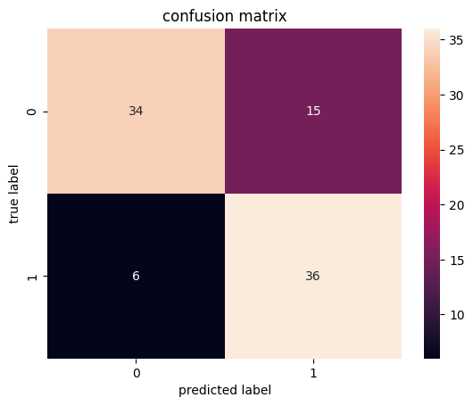

# Loan Status Prediction

- In this Loan Status Prediction dataset, we have the data of applicants who previously applied for the loan based on the property which is a Property Loan.  
- The bank will decide whether to give a loan to the applicant based on some factors such as Applicant Income, Loan Amount, previous Credit History, Co-applicant Income, etc…  
- Our goal is to build a Machine Learning Model to predict the loan to be approved or to be rejected for an applicant.

# Dataset link
https://www.kaggle.com/datasets/bhavikjikadara/loan-status-prediction/data

## **Important Note**
From the beginning, the main goal was to make predictions only using **Logistic Regression**. But my results were **very bad**, then I started making predictions with **balanced data**, but that **didn't help either**. That's how I ended up with **Random Forest with balanced data**.  
The result surprised me.  
So I decided to show a comparison of **all three methods** and why Random Forest turned out to be the best.

# Dataset analysis
All code [analysis/logistic_regression.ipynb](analysis/logistic_regression.ipynb)

Analysis of the main dataset includes cleaning up missing values ​​and removing outliers.
The most difficult question was what to do with the missing values ​​in Credit_History. There were 30/358 missing values ​​in this column. Simple deletion would have been overkill for the prediction.

Also a good solution would be to replace the missing values ​​with the largest value in the dataset.
``` python
Credit_History
1.0    282
0.0     46
Name: count, dtype: int64
```
But in reality, credit history cannot be replaced by a specific value because this column has a big impact on predictions.

The best solution was to replace the missing values ​​with "unavailable." This makes sense because people with unavailable credit histories also have a significant impact on the predictions.
``` python
df_no_null['Credit_History'] = df_no_null['Credit_History'].fillna("unavailable")
```
## Categorical Variables
The next step was to transform the categorical variables. My solution used the map method for the columns Gender, Married, Dependents, Education, Self_Employed, Credit_History, Property_Area and Loan_Status.
``` python
df_dummies['Gender'] = df_dummies['Gender'].map({"Male": 0, "Female":1})
```

## Outliers
To detect outliers, distplot from the seaborn library was used.
``` python
sns.displot(df_dummies_1['ApplicantIncome'])
```


There are quite influential outliers on the right side of the distplot. We can remove the 1% largest outliers.
``` python
q = df_dummies_1['ApplicantIncome'].quantile(0.99)
df_dummies_1 = df_dummies_1[df_dummies_1['ApplicantIncome']<q]

sns.displot(df_dummies_1['ApplicantIncome'])
```


## Scaling

Another important step is to scale the numeric variables.
``` python
from sklearn.preprocessing import StandardScaler

df_scaled = df_dummies_1.copy()

columns_to_scale = ['ApplicantIncome', 'CoapplicantIncome', 'LoanAmount', 'Loan_Amount_Term']

scaler = StandardScaler()

df_scaled[columns_to_scale] = scaler.fit_transform(df_scaled[columns_to_scale])
```

# Prediction with Logistic Regression
To evaluate the prediction, we will use the confusion matrix and classification report.
Let's look at the confusion matrix:


As we can see the ratio between 0 and 1 is very large(6:50). We can check the classification report to see if there is indeed something wrong.

|              | precision | recall | f1-score | support |
|--------------|-----------|--------|----------|---------|
| 0            | 0.750000  | 0.400000 | 0.521739 | 15.000000 |
| 1            | 0.847458  | 0.961538 | 0.900901 | 52.000000 |
| accuracy     | 0.835821  | 0.835821 | 0.835821 | 0.835821 |
| macro avg    | 0.798729  | 0.680769 | 0.711320 | 67.000000 |
| weighted avg | 0.825639  | 0.835821 | 0.816014 | 67.000000 |

The numbers are not impressive, especially the recall of 0.

The problem arose due to an imbalance in the number of values ​​0 and 1.

# Balancing in the Loan_Status column

All Code [analysis/class_balancing.ipynb](analysis/class_balancing.ipynb)

The SMOTE method was used for the balance for task.

``` python
from imblearn.over_sampling import SMOTE
y = data['Loan_Status']
x = data.drop(['Loan_Status'], axis=1)

# SMOTE realization
sm = SMOTE(random_state=42, k_neighbors=5)

x_res, y_res = sm.fit_resample(x, y)
```
0 and 1 in the updated Loan_Status column.

``` python
Loan_Status
1    184
0    177
Name: count, dtype: int64
```
Train the model and look at the confusion matrix.



The balance between 0 and 1 has been established. Let's check the classification report.

|              | precision | recall | f1-score | support |
|--------------|-----------|--------|----------|---------|
| 0            | 0.850000  | 0.693878 | 0.764045 | 49.000000 |
| 1            | 0.705882  | 0.857143 | 0.774194 | 42.000000 |
| accuracy     | 0.769231  | 0.769231 | 0.769231 | 0.769231 |
| macro avg    | 0.777941  | 0.775510 | 0.769119 | 91.000000 |
| weighted avg | 0.783484  | 0.769231 | 0.768729 | 91.000000 |

Recall of 0, although increased, remains quite low. In addition, the number of precision and recall of 1 decreased.

It becomes clear that Logistic Regression does not cope with this task.

# Random Forest

A Random Forest is a collection of decision trees that work together to make predictions. Before starting, we balance 0 and 1 using SMOTE.

Before starting, balance 0 and 1 using SMOTE. Then train the model.

``` python
# SMOTE realization
sm = SMOTE(random_state=42, k_neighbors=5)
x_res, y_res = sm.fit_resample(x, y)

x_train, x_test, y_train, y_test = train_test_split(x_res, y_res, test_size=0.2, random_state=20)

# Random Forest realization
model = RandomForestClassifier(n_estimators=100, random_state=42)
model.fit(x_train, y_train)
```
**Confusion Matrix**
[conf_matrix](img/rf_matrix.png)

**Classification Report**

|              | precision | recall | f1-score | support |
|--------------|-----------|--------|----------|---------|
| 0            | 0.931818  | 0.836735 | 0.881720 | 49.000000 |
| 1            | 0.829787  | 0.928571 | 0.876404 | 42.000000 |
| accuracy     | 0.879121  | 0.879121 | 0.879121 | 0.879121 |
| macro avg    | 0.880803  | 0.882653 | 0.879062 | 91.000000 |
| weighted avg | 0.884727  | 0.879121 | 0.879267 | 91.000000 |

The results after Random Forest are the best. 

For comparison, we can look at the presionn vs. recall in each of the situations.


