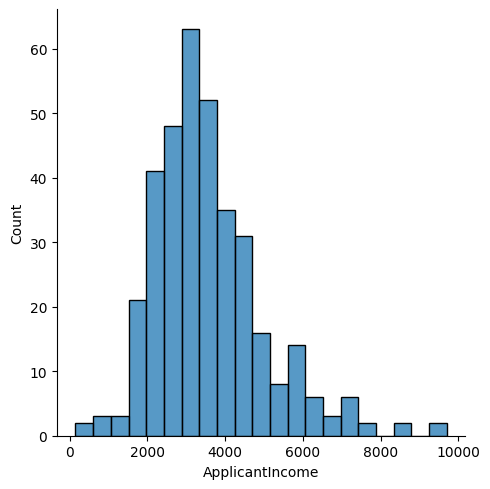
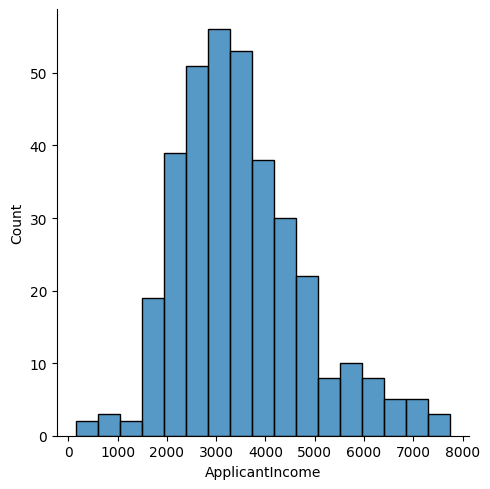
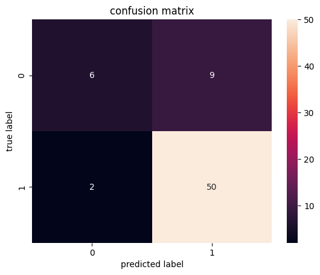

# Loan Status Prediction

- In this Loan Status Prediction dataset, we have the data of applicants who previously applied for the loan based on the property which is a Property Loan.  
- The bank will decide whether to give a loan to the applicant based on some factors such as Applicant Income, Loan Amount, previous Credit History, Co-applicant Income, etc…  
- Our goal is to build a Machine Learning Model to predict the loan to be approved or to be rejected for an applicant.

# Dataset link
https://www.kaggle.com/datasets/bhavikjikadara/loan-status-prediction/data

## **Important Note**
From the beginning, the main goal was to make predictions only using **Logistic Regression**. But my results were **very bad**, then I started making predictions with **balanced data**, but that **didn't help either**. That's how I ended up with **Random Forest with balanced data**.  
The result surprised me.  
So I decided to show a comparison of **all three methods** and why Random Forest turned out to be the best.

# Dataset analysis
All code [log_reg](analysis/logistic_regression.ipynb)
Analysis of the main dataset includes cleaning up missing values ​​and removing outliers.
The most difficult question was what to do with the missing values ​​in Credit_History. There were 30/358 missing values ​​in this column. Simple deletion would have been overkill for the prediction.

Also a good solution would be to replace the missing values ​​with the largest value in the dataset.
``` python
Credit_History
1.0    282
0.0     46
Name: count, dtype: int64
```
But in reality, credit history cannot be replaced by a specific value because this column has a big impact on predictions.

The best solution was to replace the missing values ​​with "unavailable." This makes sense because people with unavailable credit histories also have a significant impact on the predictions.
``` python
df_no_null['Credit_History'] = df_no_null['Credit_History'].fillna("unavailable")
```
## Categorical Variables
The next step was to transform the categorical variables. My solution used the map method for the columns Gender, Married, Dependents, Education, Self_Employed, Credit_History, Property_Area and Loan_Status.
``` python
df_dummies['Gender'] = df_dummies['Gender'].map({"Male": 0, "Female":1})
```

## Outliers
To detect outliers, distplot from the seaborn library was used.
``` python
sns.displot(df_dummies_1['ApplicantIncome'])
```

There are quite influential outliers on the right side of the distplot. We can remove the 1% largest outliers.
``` python
q = df_dummies_1['ApplicantIncome'].quantile(0.99)
df_dummies_1 = df_dummies_1[df_dummies_1['ApplicantIncome']<q]

sns.displot(df_dummies_1['ApplicantIncome'])
```


## Scaling

Another important step is to scale the numeric variables.
``` python
from sklearn.preprocessing import StandardScaler

df_scaled = df_dummies_1.copy()

columns_to_scale = ['ApplicantIncome', 'CoapplicantIncome', 'LoanAmount', 'Loan_Amount_Term']

scaler = StandardScaler()

df_scaled[columns_to_scale] = scaler.fit_transform(df_scaled[columns_to_scale])
```

# Prediction with Logistic Regression
To evaluate the prediction, we will use the confusion matrix and classification report.
Let's look at the confusion matrix:

As we can see the ratio between 0 and 1 is very large. 6:50. We can check the classification report to see if there is indeed something wrong.
|              | precision | recall | f1-score | support |
|--------------|-----------|--------|----------|---------|
| 0            | 0.750000  | 0.400000 | 0.521739 | 15.000000 |
| 1            | 0.847458  | 0.961538 | 0.900901 | 52.000000 |
| accuracy     | 0.835821  | 0.835821 | 0.835821 | 0.835821 |
| macro avg    | 0.798729  | 0.680769 | 0.711320 | 67.000000 |
| weighted avg | 0.825639  | 0.835821 | 0.816014 | 67.000000 |
The numbers are not impressive, especially the recall of 0.

The problem arose due to an imbalance in the number of values ​​0 and 1.


